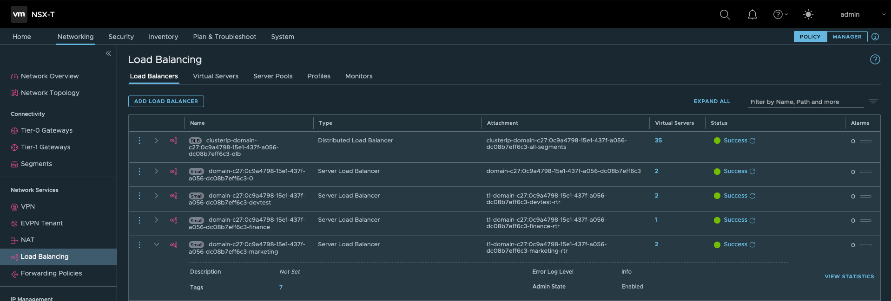
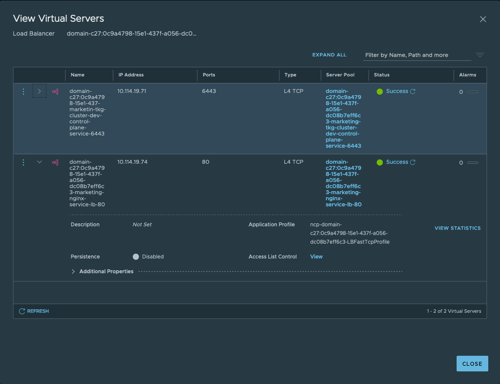
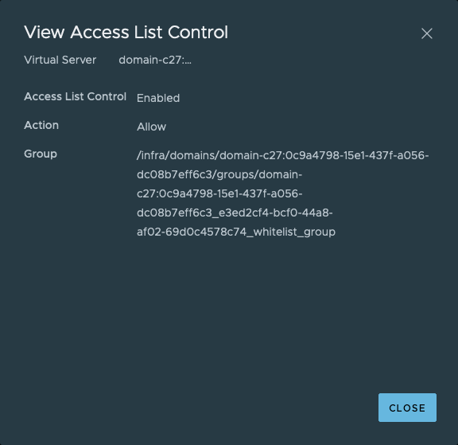
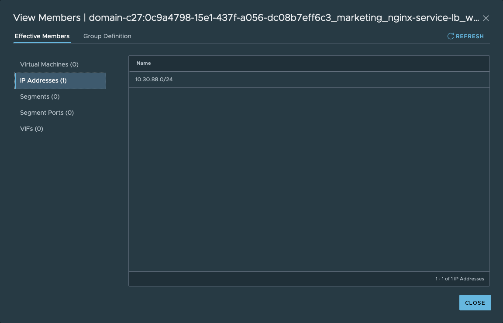

# Load Balancer Source Ranges 
## Introduction
This guide is to demonstrate the usage of the loadBalancerSourceRanges spec for the Kubernetes Service resource. 

If specified the loadBalancerSourceRanges spec, traffic towards the NSX-T Load Balancer will be allowed from the specified source IPs only. 

## User Story
As a DevOps Engineer I only want to expose my application to specific source subnet(s) to meet security requirements.

## Example
Below is an example of a Service of type LoadBalancer configuration file where we want to expose a NGINX web application based on the selector ```app: nginx```

```yaml
apiVersion: v1
kind: Service
metadata:
  name: nginx-service-lb
  labels:
    app: nginx
spec:
  type: LoadBalancer
  loadBalancerSourceRanges:
    - "10.30.88.116/24"
  ports:
    - port: 80
      targetPort: 80
      protocol: TCP
      name: tcp
  selector:
    app: nginx
```
Apply the configuration file:
```
kubectl apply -f loadbalancer-source-ranges.yaml
```
Details of the service: 
```
kubectl describe service nginx-service-lb

Name:                        nginx-service-lb
Namespace:                   marketing
Labels:                      app=nginx
Annotations:                 ncp/internal_ip_for_policy: 100.64.112.13
Selector:                    app=nginx
Type:                        LoadBalancer
IP:                          10.96.0.170
LoadBalancer Ingress:        10.114.19.74
Port:                        tcp  80/TCP
TargetPort:                  80/TCP
NodePort:                    tcp  30821/TCP
Endpoints:                   10.244.0.102:80,10.244.0.103:80
Session Affinity:            None
External Traffic Policy:     Cluster
LoadBalancer Source Ranges:  10.30.88.116/24
Events:
  Type    Reason                        Age   From                                                 Message
  ----    ------                        ----  ----                                                 -------
  Normal  SuccessfulRealizeNSXResource  11m   nsx-container-ncp, 4230a1663988a1b5f1f90fd66215d770  Successfully realized NSX resource for Service
  ```
Note the LoadBalancer Ingress IP assigned by NSX-T IPAM 10.114.19.74 and the configured LoadBalancer Source Range 10.30.88.116/24

In NSX-T we can find the configured Load Balancer and Server Pool.


There is a new Virtual Server configured on the NSX-T Load Balancer. The virtual server listens on port 80. 


Based on the ```loadBalancerSourceRanges:``` specification NSX-T will configure Access List Control on the Virtual Server using an automatically created Group. 



You can view the Group configured with the 10.30.88.0/24 IP 


Now I can only access the Application from the 10.30.88.0/24 source network. 