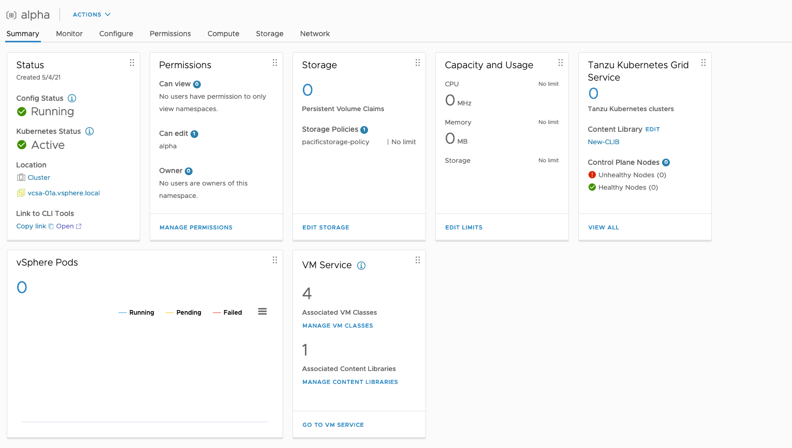
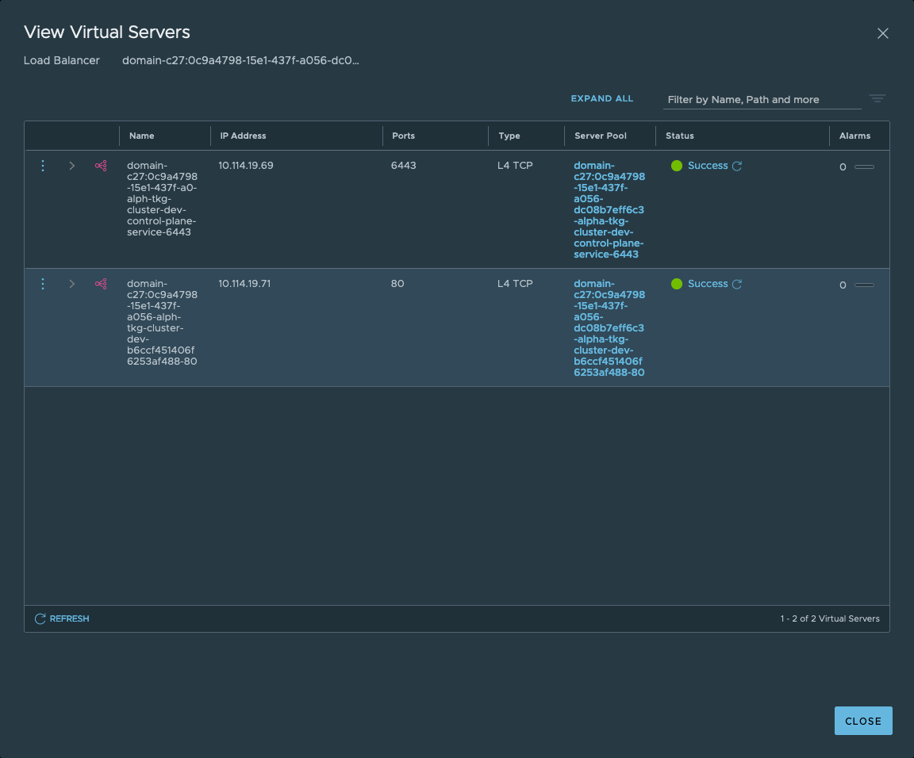

 # TKG Clusters

 by Raymond de Jong [@dejongraymond](https://twitter.com/dejongraymond) / [LinkedIn](https://linkedin.com/in/dejongraymond) / [Blog](https://www.cloudxtreme.com)

_**This disclaimer informs readers that the views, thoughts, and opinions expressed in this series of posts belong solely to the author, and not necessarily to the author’s employer, organization, committee or other group or individual.**_

## Introduction
This is an example and demo on how to create a Tanzu Kubernetes Grid (TKG) Cluster on vSphere with Tanzu on NSX-T.

In this example there are two persona's involved. The VI Admin managing vSphere with Tanzu on NSX-T and the DevOps Engineer requesting and using the Kubernetes Cluster to develop and run their workloads. 

## Preparation
The VI-Admin will configure:
- A Namespace
- Permissions using vSphere SSO
- Storage Polices to be used
- Capacity and Resource Usage Limits
- Tanzu Kubernetes Grid Content Library
- VM Service and VM Class



The Devops Engineer will then be able to deploy a TKG Cluster using available Images in the Content Library and configured VM Classes. After which it can access Kubernets API through the provisioned IP and NSX-T Load Balancer.

## NSX-T Configuration 
Once the VI-Admin has configured the Namespace, The Supervisor Cluster will configure automatically the required NSX-T objects to support the Namespace including:
- Tier-1 Gateway connected to the preconfigured Tier-0
- A Segment to the connect TKG Clusters Nodes. 
- IP Subnet (/28) and Gateway Address on the Tier-1 Gateway
- Small Load Balancer using an Ingress IP
- SNAT rules using an Egress IP for connections from the Namespace to the outside world
- DFW Firewall rules to isolate the namespace. By default traffic between different namespaces is denied and traffic within a namespace is allowed. 

Notes: 
- Each TKG Cluster will be allocated a dedicated Segment connected to a shared Tier-1 Gateway. 
- Each TKG Cluster will be configured with a Server Pool and dedicated Ingress IP (External IP) accesible through a shared Load Balancer. 
- TKG Clusters will share the Egress (SNAT) IP in a Namespace

## TKG Cluster Configuration
The DevOps Engineer can now login on the Supervisor Cluster to use the Namespace.
```
kubectl vsphere login --server=10.114.19.65 --insecure-skip-tls-verify

You have access to the following contexts:
   10.114.19.65
   alpha
   api.ray.salab.local
   kubernetes-admin@kubernetes

If the context you wish to use is not in this list, you may need to try
logging in again later, or contact your cluster administrator.

To change context, use `kubectl config use-context <workload name>`
```
Change the context to use the right Namespace:
```
kubectl config set-context alpha
```
Check Namespace details:
```
kubectl describe ns alpha

Name:         alpha
Labels:       vSphereClusterID=domain-c27
Annotations:  ls_id-0: fe05b092-9626-4314-ac13-22719cccf506
              ncp/extpoolid: domain-c27:0c9a4798-15e1-437f-a056-dc08b7eff6c3-ippool-10-114-19-161-10-114-19-190
              ncp/router_id: t1_976ece6c-2c8b-4184-9d1c-ee98b4e89227_rtr
              ncp/snat_ip: 10.114.19.164
              ncp/subnet-0: 10.244.0.80/28
              vmware-system-resource-pool: resgroup-49290
              vmware-system-vm-folder: group-v49291
Status:       Active

Resource Quotas
 Name:                                                               alpha-storagequota
 Resource                                                            Used  Hard
 --------                                                            ---   ---
 pacificstorage-policy.storageclass.storage.k8s.io/requests.storage  0     9223372036854775807
```
Note the SNAT IP (Egress) and the Subnet allocated to the namespace. Also note any Resource Quotas if configured. 

Check for available Images in the Content Libary:
```
kubectl get virtualmachineimages
NAME                                                         VERSION                           OSTYPE                FORMAT   AGE
ob-15957779-photon-3-k8s-v1.16.8---vmware.1-tkg.3.60d2ffd    v1.16.8+vmware.1-tkg.3.60d2ffd    vmwarePhoton64Guest   ovf      91m
ob-16466772-photon-3-k8s-v1.17.7---vmware.1-tkg.1.154236c    v1.17.7+vmware.1-tkg.1.154236c    vmwarePhoton64Guest   ovf      91m
ob-16545581-photon-3-k8s-v1.16.12---vmware.1-tkg.1.da7afe7   v1.16.12+vmware.1-tkg.1.da7afe7   vmwarePhoton64Guest   ovf      91m
ob-16551547-photon-3-k8s-v1.17.8---vmware.1-tkg.1.5417466    v1.17.8+vmware.1-tkg.1.5417466    vmwarePhoton64Guest   ovf      91m
ob-16897056-photon-3-k8s-v1.16.14---vmware.1-tkg.1.ada4837   v1.16.14+vmware.1-tkg.1.ada4837   vmwarePhoton64Guest   ovf      91m
ob-16924026-photon-3-k8s-v1.18.5---vmware.1-tkg.1.c40d30d    v1.18.5+vmware.1-tkg.1.c40d30d    vmwarePhoton64Guest   ovf      91m
ob-16924027-photon-3-k8s-v1.17.11---vmware.1-tkg.1.15f1e18   v1.17.11+vmware.1-tkg.1.15f1e18   vmwarePhoton64Guest   ovf      91m
ob-17010758-photon-3-k8s-v1.17.11---vmware.1-tkg.2.ad3d374   v1.17.11+vmware.1-tkg.2.ad3d374   vmwarePhoton64Guest   ovf      91m
ob-17332787-photon-3-k8s-v1.17.13---vmware.1-tkg.2.2c133ed   v1.17.13+vmware.1-tkg.2.2c133ed   vmwarePhoton64Guest   ovf      91m
ob-17419070-photon-3-k8s-v1.18.10---vmware.1-tkg.1.3a6cd48   v1.18.10+vmware.1-tkg.1.3a6cd48   vmwarePhoton64Guest   ovf      91m
ob-17654937-photon-3-k8s-v1.18.15---vmware.1-tkg.1.600e412   v1.18.15+vmware.1-tkg.1.600e412   vmwarePhoton64Guest   ovf      91m
ob-17658793-photon-3-k8s-v1.17.17---vmware.1-tkg.1.d44d45a   v1.17.17+vmware.1-tkg.1.d44d45a   vmwarePhoton64Guest   ovf      91m
ob-17660956-photon-3-k8s-v1.19.7---vmware.1-tkg.1.fc82c41    v1.19.7+vmware.1-tkg.1.fc82c41    vmwarePhoton64Guest   ovf      91m
ob-17861429-photon-3-k8s-v1.20.2---vmware.1-tkg.1.1d4f79a    v1.20.2+vmware.1-tkg.1.1d4f79a    vmwarePhoton64Guest   ovf      91m
```
Check the available Virtual Machine Class Bindings configured for the Namespace:
```
NAME                 VIRTUALMACHINECLASS   AGE
best-effort-large    best-effort-large     37m
best-effort-medium   best-effort-medium    37m
best-effort-small    best-effort-small     37m
best-effort-xsmall   best-effort-xsmall    37m
```
Based on the details above we can contruct a manifest file for our first TKG Cluster. For example the [tkg-cluster-dev.yaml](tkg-cluster-dev.yaml)

Deploy the TKG Cluster:
```
kubectl apply -f tkg-cluster-dev.yaml
```
It will take some time to deploy the Images and to configure the TKG Cluster. 
Check the TKG Cluster details:
```
kubectl describe tanzukubernetesclusters tkg-cluster-dev
```
Check the TKG Cluster:
```
kubectl get tanzukubernetesclusters
```
Check the External IP created for the TKG Cluster (LoadBalancer IP)
```
kubectl get service
NAME                                    TYPE           CLUSTER-IP   EXTERNAL-IP    PORT(S)          AGE
tkg-cluster-dev-control-plane-service   LoadBalancer   10.96.0.85   10.114.19.69   6443:31772/TCP   9m36s
```
Note that if you create multiple TKG Clusters in a given namespace each namespace will be allocated a dedicated External IP. 
```
kubectl get service
NAME                                     TYPE           CLUSTER-IP    EXTERNAL-IP    PORT(S)          AGE
tkg-cluster-dev-control-plane-service    LoadBalancer   10.96.0.85    10.114.19.69   6443:31772/TCP   33m
tkg-cluster-prod-control-plane-service   LoadBalancer   10.96.0.216   10.114.19.71   6443:31707/TCP   10m
```
Log in on the TKG Cluster itself to be able to create Namespaces and Workloads. 
```
kubectl vsphere login --server=10.114.19.65 --vsphere-username alpha@vsphere.local --tanzu-kubernetes-cluster-name tkg-cluster-dev --tanzu-kubernetes-cluster-namespace test  --insecure-skip-tls-verify
```
Check the Cluster info:
```
kubectl cluster-info

Kubernetes master is running at https://10.114.19.69:6443
KubeDNS is running at https://10.114.19.69:6443/api/v1/namespaces/kube-system/services/kube-dns:dns/proxy

To further debug and diagnose cluster problems, use 'kubectl cluster-info dump'.
```
Get Cluster Nodes:
```
kubectl get nodes -o wide

NAME                                             STATUS   ROLES                  AGE   VERSION            INTERNAL-IP    EXTERNAL-IP   OS-IMAGE                 KERNEL-VERSION       CONTAINER-RUNTIME
tkg-cluster-dev-control-plane-b5g4j              Ready    control-plane,master   19h   v1.20.2+vmware.1   10.244.0.98    <none>        VMware Photon OS/Linux   4.19.174-4.ph3-esx   containerd://1.4.3
tkg-cluster-dev-workers-96cwk-6fcd7d4947-92crg   Ready    <none>                 19h   v1.20.2+vmware.1   10.244.0.99    <none>        VMware Photon OS/Linux   4.19.174-4.ph3-esx   containerd://1.4.3
tkg-cluster-dev-workers-96cwk-6fcd7d4947-stvks   Ready    <none>                 19h   v1.20.2+vmware.1   10.244.0.100   <none>        VMware Photon OS/Linux   4.19.174-4.ph3-esx   containerd://1.4.3
```
Deploy the Guestbook Application as documented [on VMware Documentation Site](https://docs.vmware.com/en/VMware-vSphere/7.0/vmware-vsphere-with-tanzu/GUID-CC395BC6-5E65-43F0-9828-5C3BAD6B8385.html)
The Guestbook application YAML files are also in the [guestbook]() folder in this repository. 

Check the Guestbook resources:
```
kubectl get all -n guestbook

NAME                                                 READY   STATUS             RESTARTS   AGE
pod/guestbook-frontend-deployment-85595f5bf9-bhl22   1/1     Running            0          7m31s
pod/guestbook-frontend-deployment-85595f5bf9-gflz5   1/1     Running            0          7m31s
pod/guestbook-frontend-deployment-85595f5bf9-kdnhm   1/1     Running            0          7m31s
pod/redis-follower-deployment-84cd76b975-rh44l       1/1     Running            0          7m30s
pod/redis-leader-deployment-69df9b5688-sqtff         1/1     Running            0          37s

NAME                         TYPE           CLUSTER-IP       EXTERNAL-IP    PORT(S)        AGE
service/guestbook-frontend   LoadBalancer   198.60.161.107   10.114.19.71   80:32579/TCP   7m32s
service/redis-follower       ClusterIP      198.59.95.121    <none>         6379/TCP       7m30s
service/redis-leader         ClusterIP      198.63.70.173    <none>         6379/TCP       7m28s

NAME                                            READY   UP-TO-DATE   AVAILABLE   AGE
deployment.apps/guestbook-frontend-deployment   3/3     3            3           7m32s
deployment.apps/redis-follower-deployment       1/1     1            1           7m31s
deployment.apps/redis-leader-deployment         0/1     1            0           38s

NAME                                                       DESIRED   CURRENT   READY   AGE
replicaset.apps/guestbook-frontend-deployment-85595f5bf9   3         3         3       7m32s
replicaset.apps/redis-follower-deployment-84cd76b975       1         1         1       7m31s
replicaset.apps/redis-leader-deployment-69df9b5688         1         1         0       38s
```
Note the External-IP 10.114.19.71 being created for Service Type LoadBalancer. This Load Balancer is being created in NSX-T. The LB IP is from the Supervisor Cluster Ingress IP Pool. A Server Pool is being created on the shared Namespace (Small) Load Balancer instance. The Load Balancer is listening on Port 80 and the Pool Members are the Worker Nodes listening on Port 32579.


